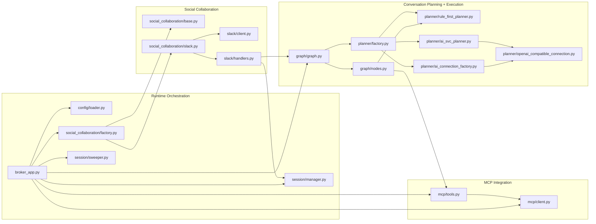
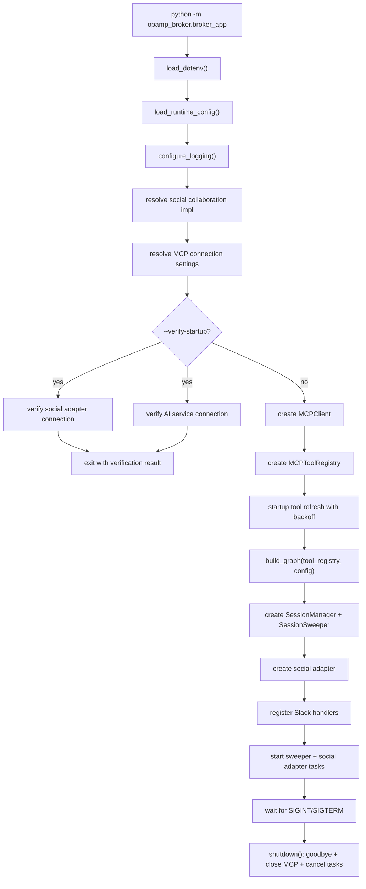
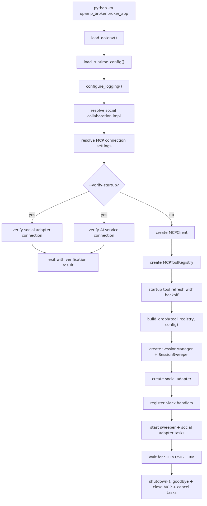
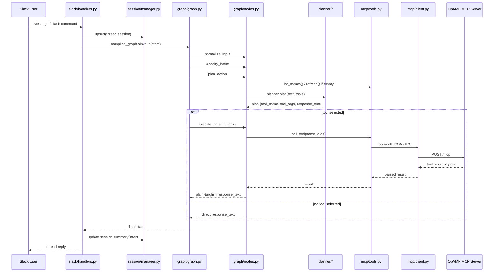
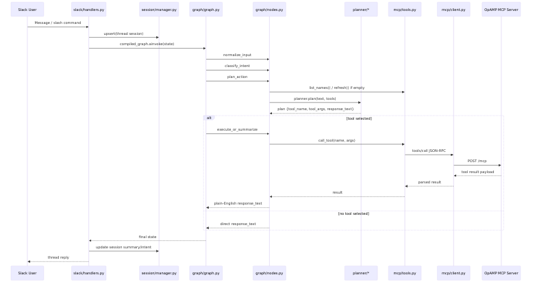

# Broker Code Structure Diagrams

This page provides a code-oriented view of how `opamp_broker` modules fit
together at startup and at request-processing time.

## 1) Module/package overview

## 2) Startup wiring flow

## 3) Request-processing flow

