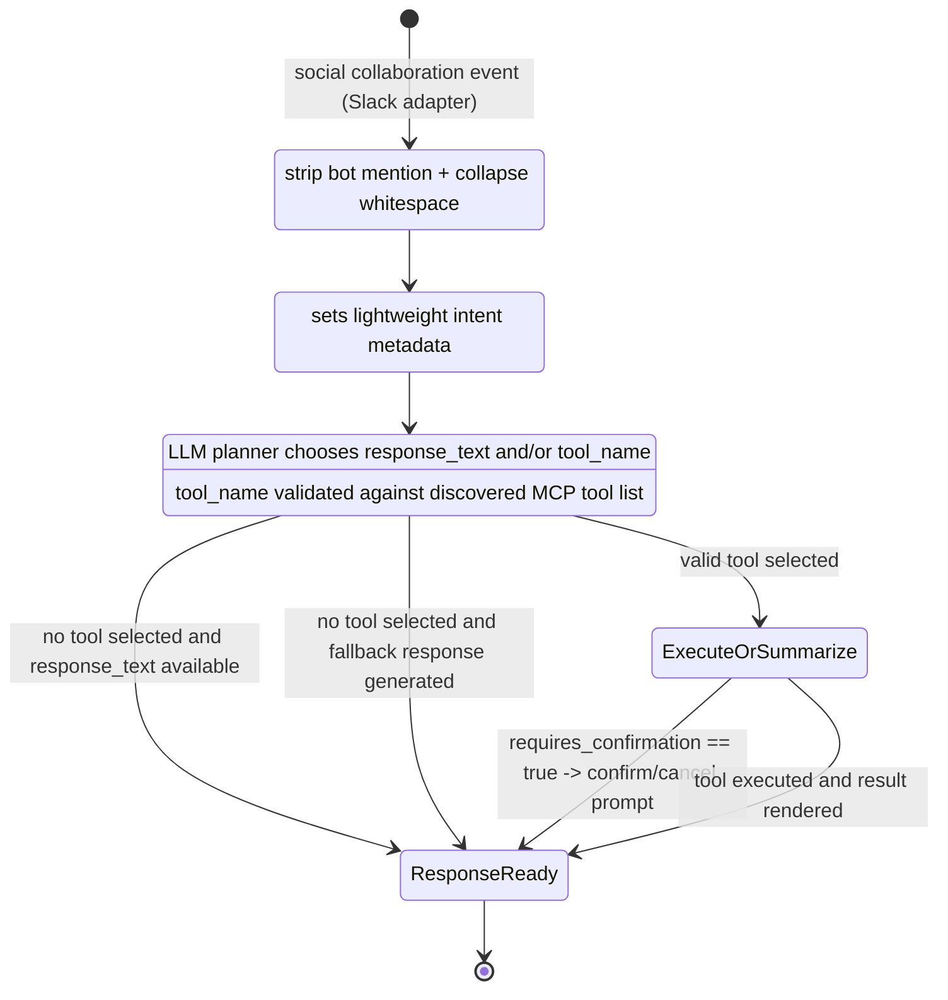
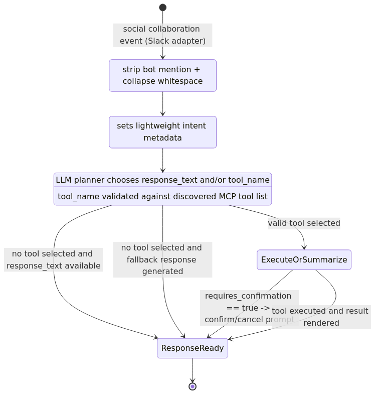

# Broker Graph State Transitions

This diagram describes the `opamp_broker` conversation graph states and the
triggers that move a request between states.

```mermaid
stateDiagram-v2
    [*] --> NormalizeInput : social collaboration event (Slack adapter)
    NormalizeInput : strip bot mention + collapse whitespace
    NormalizeInput --> ClassifyIntent

    ClassifyIntent : sets lightweight intent metadata
    ClassifyIntent --> PlanAction

    PlanAction : LLM planner chooses response_text and/or tool_name
    PlanAction : tool_name validated against discovered MCP tool list
    PlanAction --> ResponseReady : no tool selected and response_text available
    PlanAction --> ResponseReady : no tool selected and fallback response generated
    PlanAction --> ExecuteOrSummarize : valid tool selected

    ExecuteOrSummarize --> ResponseReady : requires_confirmation == true -> confirm/cancel prompt
    ExecuteOrSummarize --> ResponseReady : tool executed and result rendered

    ResponseReady --> [*]
```

## Rendered PNG

