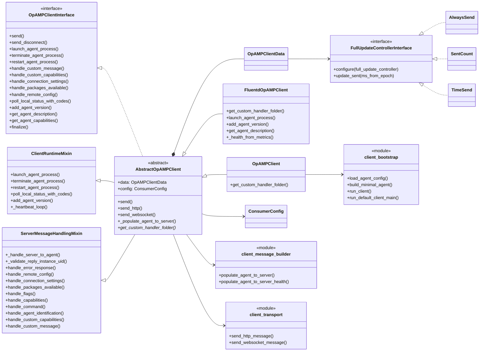
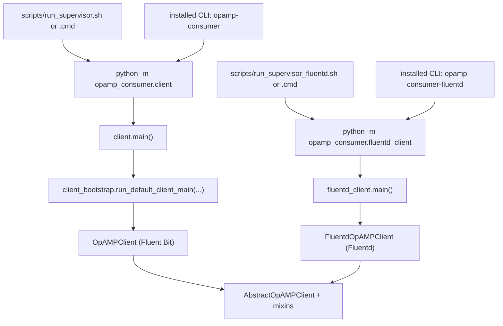
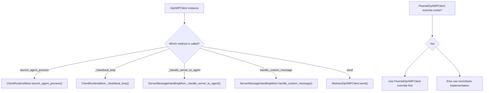
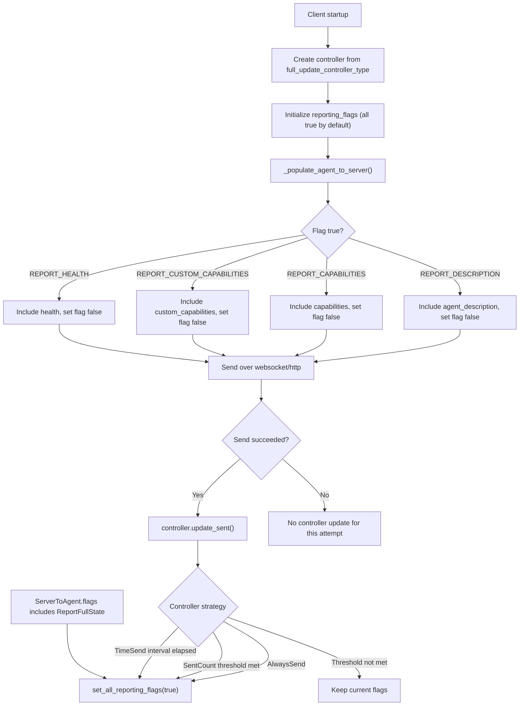

# Consumer Client Architecture Diagram

This diagram shows the current consumer structure after splitting large `client.py` responsibilities into mixins and bootstrap helpers.

## Class and Module Relationships

## Runtime Entrypoints

## Mixin Dispatch Model

## Reporting Flags and Update Controllers

