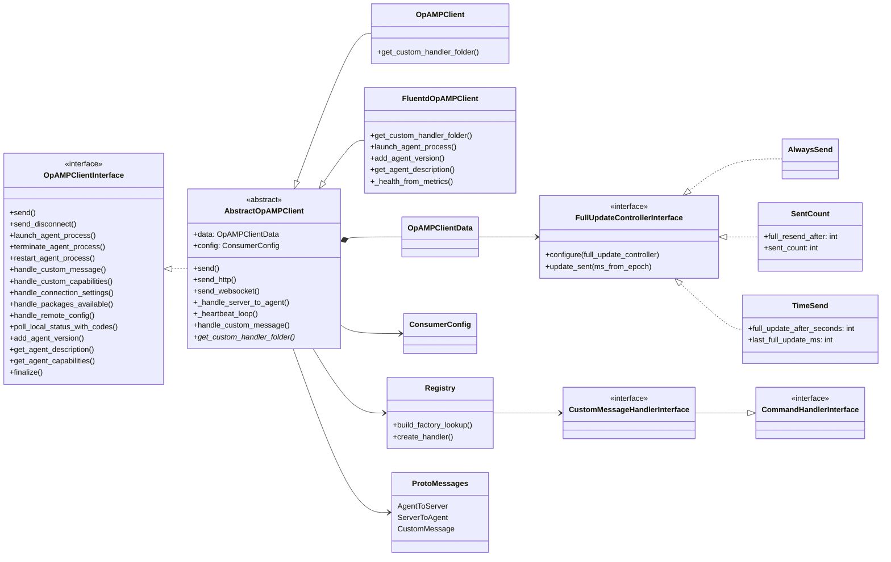
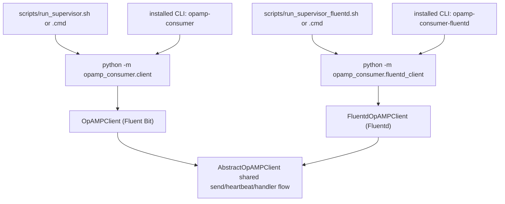
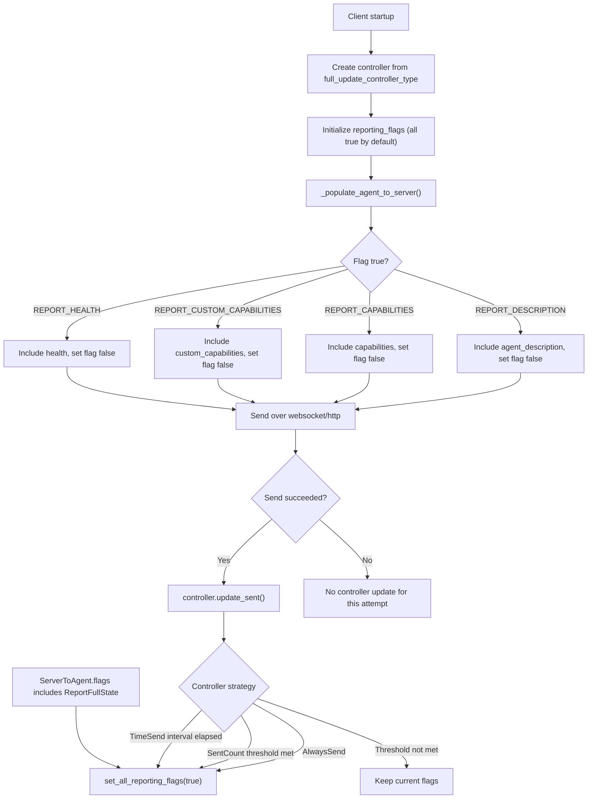

# Consumer Client Architecture Diagram

This diagram shows how the consumer-side classes and modules relate after introducing the Fluentd concrete implementation.

## Runtime Entrypoints

## Reporting Flags and Update Controllers

