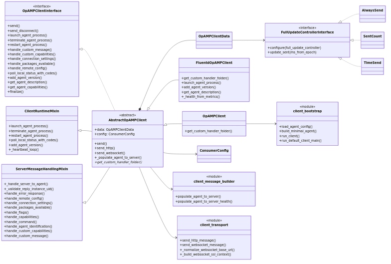
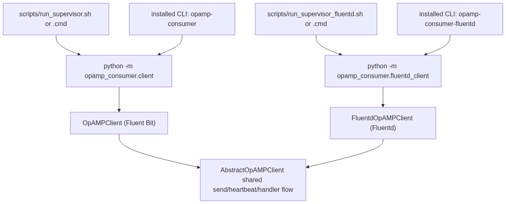
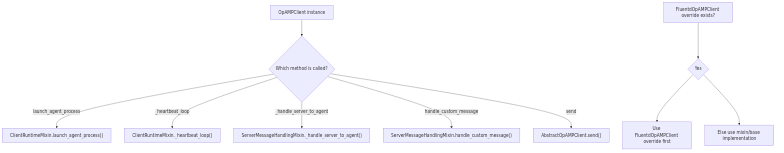

# Consumer Client Diagrams Guide

This page explains the rendered consumer client diagrams and links each one back to the Mermaid source.

## Source and Related Docs

- Mermaid source: [docs/consumer_client_diagram.md](consumer_client_diagram.md)
- Consumer mixin behavior: [docs/consumer_mixins.md](consumer_mixins.md)
- Consumer reporting/update cadence: [docs/consumer_update_controllers.md](consumer_update_controllers.md)

## Diagram 1: Class and Module Relationships

What this shows:

- `AbstractOpAMPClient` composes core send/reporting behavior.
- `ClientRuntimeMixin` and `ServerMessageHandlingMixin` contribute runtime and server-message handling behavior.
- Concrete clients (`OpAMPClient` for Fluent Bit and `FluentdOpAMPClient` for Fluentd) extend/override where needed.
- Update controller implementations (`AlwaysSend`, `SentCount`, `TimeSend`) control reporting flag reset cadence.

## Diagram 2: Runtime Entrypoints

What this shows:

- Script and CLI entrypoints for Fluent Bit and Fluentd clients.
- Bootstrap path through `client_bootstrap.run_default_client_main(...)`.
- Shared runtime behavior flowing into `AbstractOpAMPClient` + mixins.

## Diagram 3: Mixin Dispatch Model

What this shows:

- Which methods resolve in mixins vs `AbstractOpAMPClient`.
- How subclass overrides (for example in `FluentdOpAMPClient`) win over mixin/base implementations via MRO.

## Diagram 4: Reporting Flags and Update Controllers

What this shows:

- How report flags gate which payload fields are emitted.
- When controller implementations reset flags for future sends.
- How `ReportFullState` from the server forces full reporting state.
