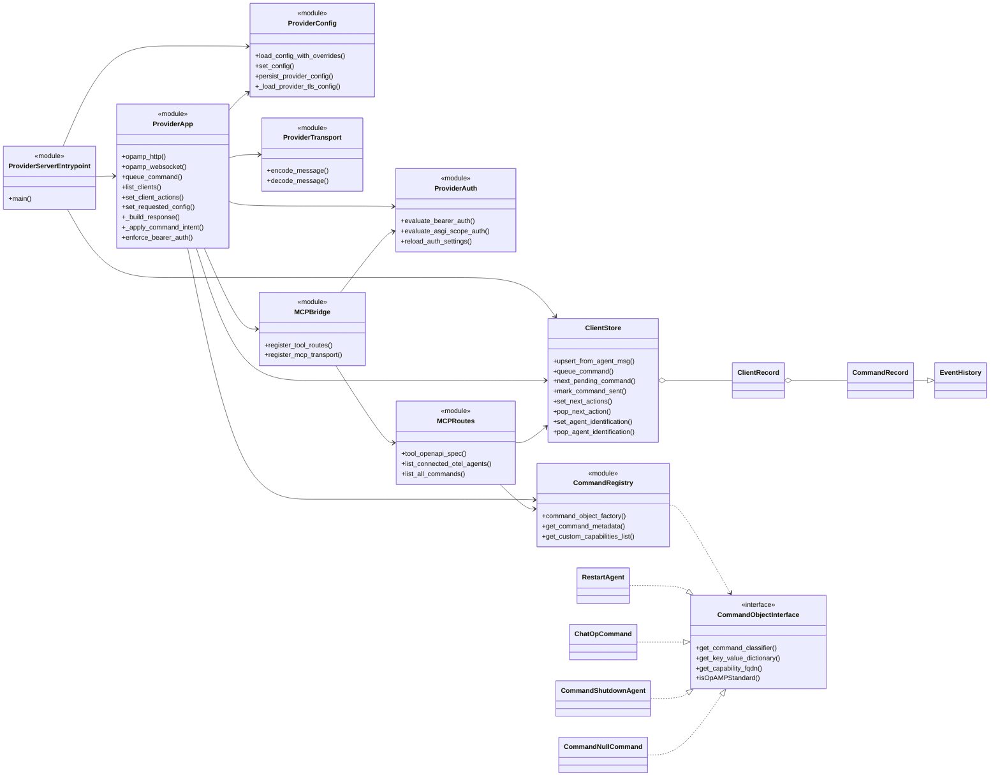
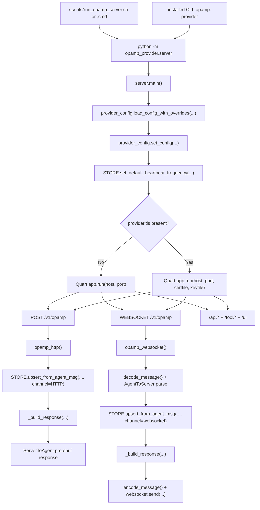
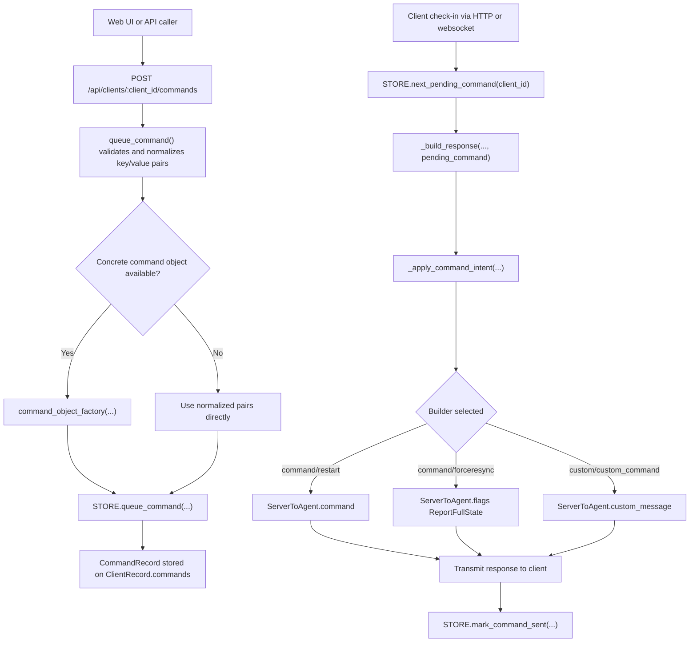
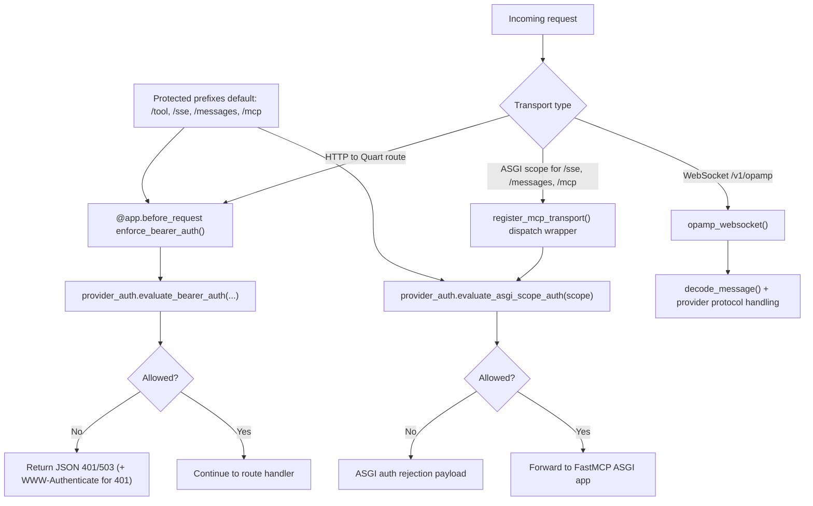

# Provider Server Architecture Diagram

This document contains Mermaid source diagrams for the provider/server side.  
Rendered PNG versions are embedded in [docs/provider_server_diagrams.md](provider_server_diagrams.md).

## Class and Module Relationships

## Runtime Entrypoints and Transport

## Command Queue and Dispatch Pipeline

## Auth and MCP Transport Routing

