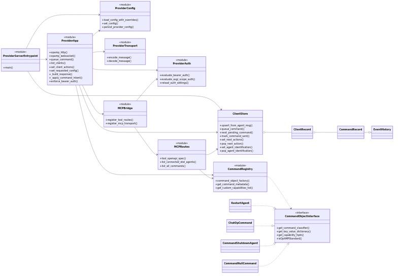
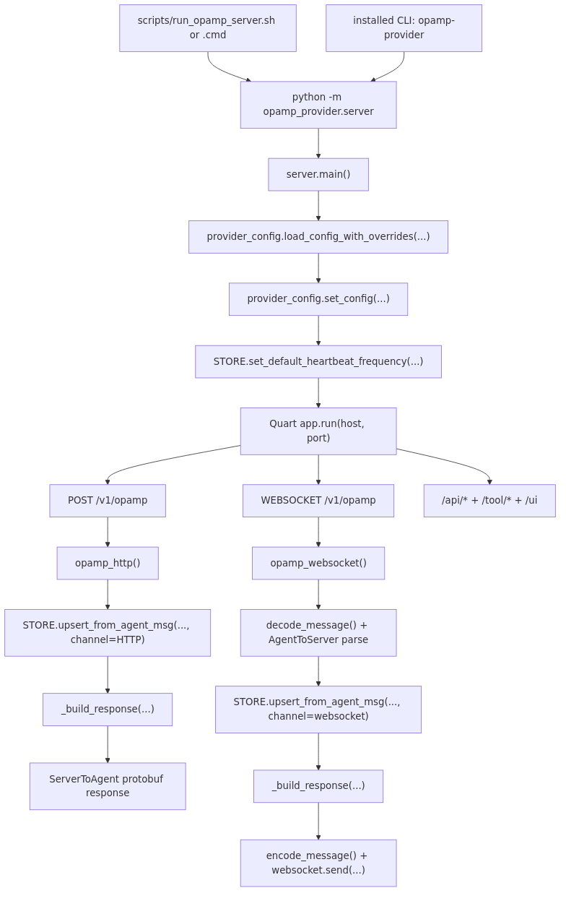
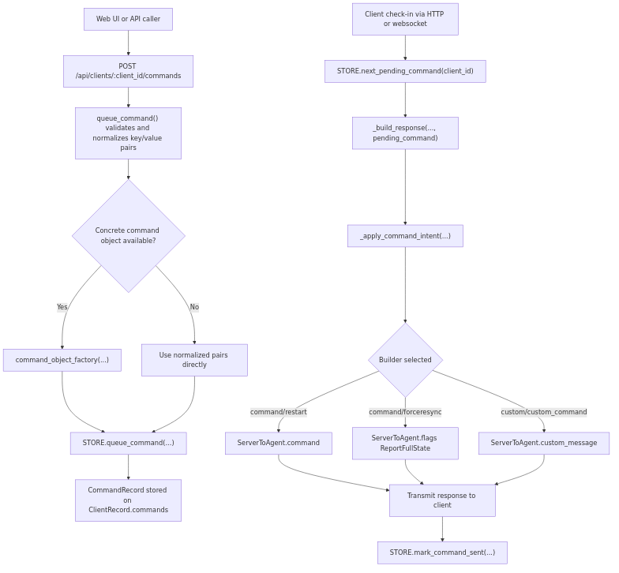
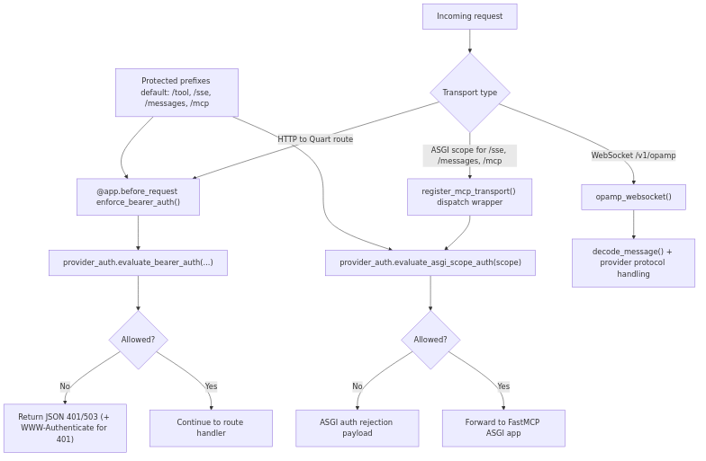

# Provider Server Diagrams Guide

This page explains the rendered provider/server diagrams and links each one back to Mermaid source and related docs.

## Source and Related Docs

- Mermaid source: [docs/provider_server_diagram.md](provider_server_diagram.md)
- Provider endpoint inventory: [docs/endpoints.md](endpoints.md)
- Provider auth setup and token modes: [docs/authentication.md](authentication.md)
- Command queue and payload internals: [docs/command_process_implementation_note.md](command_process_implementation_note.md)
- Mixin design reference (consumer-side pattern): [docs/consumer_mixins.md](consumer_mixins.md)
- TOFU extension design for `/v1/opamp`: [docs/opamp_tofu_design.md](opamp_tofu_design.md)

## Diagram 1: Class and Module Relationships

What this shows:

- `server.py` bootstraps config and starts Quart.
- `app.py` owns OpAMP transport handlers, REST/UI endpoints, and response building.
- `state.py` (`STORE`) is the in-memory source of truth for client records and queued commands.
- `commands.py` and command implementation classes build command/custom payload shapes.
- `mcptool` route and transport bridge modules expose MCP and integrate auth checks for MCP ASGI traffic.

## Diagram 2: Runtime Entrypoints and Transport

What this shows:

- Script/CLI entrypoints into `opamp_provider.server`.
- Startup path through config load, store defaults, and `app.run(...)`.
- Parallel request surfaces: OpAMP HTTP, OpAMP WebSocket, and REST/UI/tool APIs.

## Diagram 3: Command Queue and Dispatch Pipeline

What this shows:

- How `/api/clients/<client_id>/commands` normalizes input and queues `CommandRecord` entries.
- Where command object factories are used for concrete command types.
- How pending commands are consumed on the next client check-in and encoded as:
  - `ServerToAgent.command`
  - `ServerToAgent.custom_message`
  - or `ServerToAgent.flags` (full-state resync)
- How sent commands are marked complete in store state.

## Diagram 4: Auth and MCP Transport Routing

What this shows:

- HTTP route protection via `@app.before_request` and `evaluate_bearer_auth(...)`.
- MCP ASGI protection via `register_mcp_transport(...)` wrapper and `evaluate_asgi_scope_auth(...)`.
- The difference between protected MCP/tool paths and the protocol handling path for `/v1/opamp` WebSocket.
