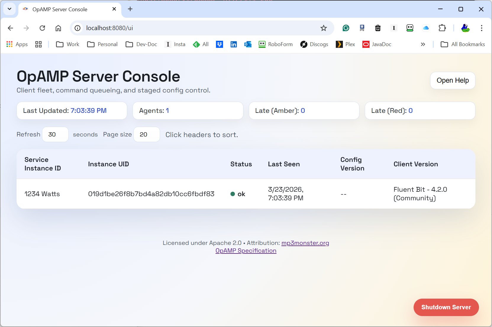
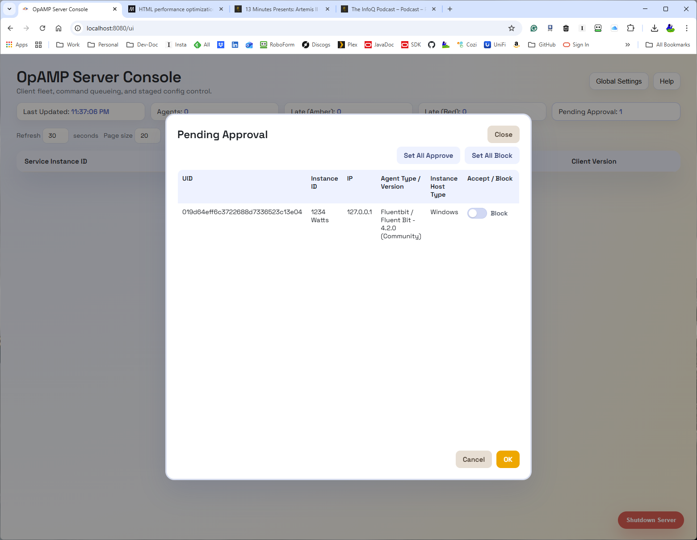
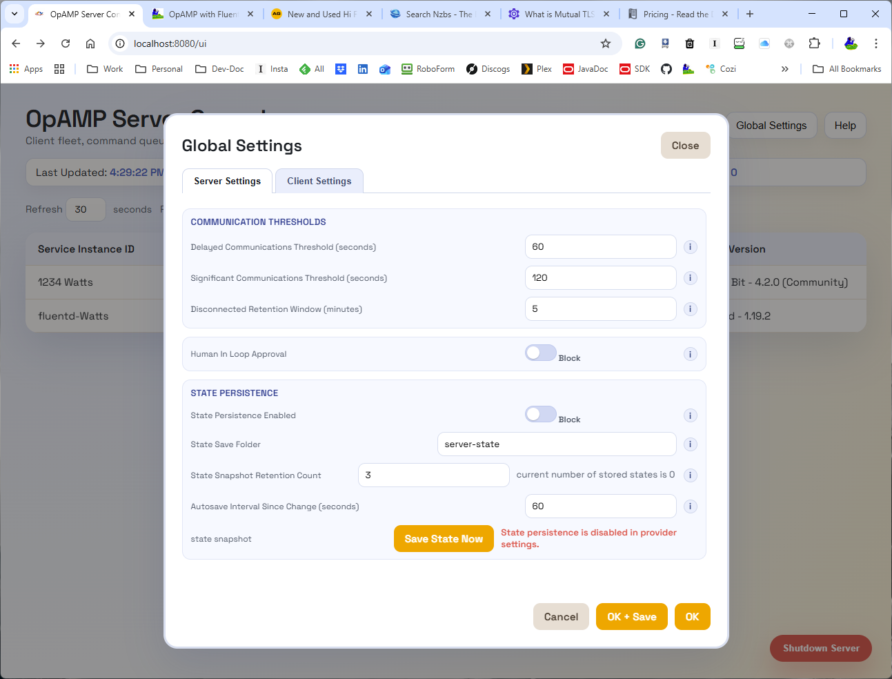
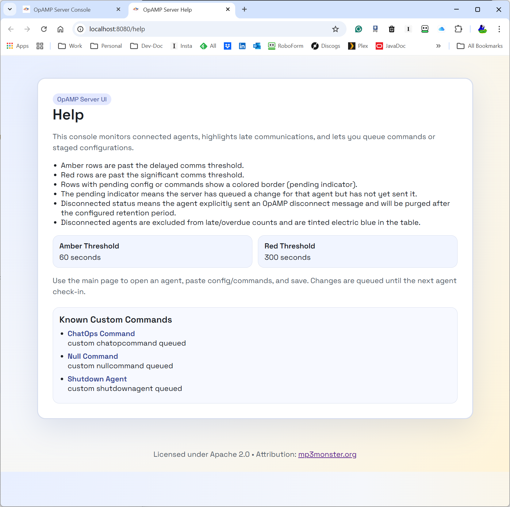
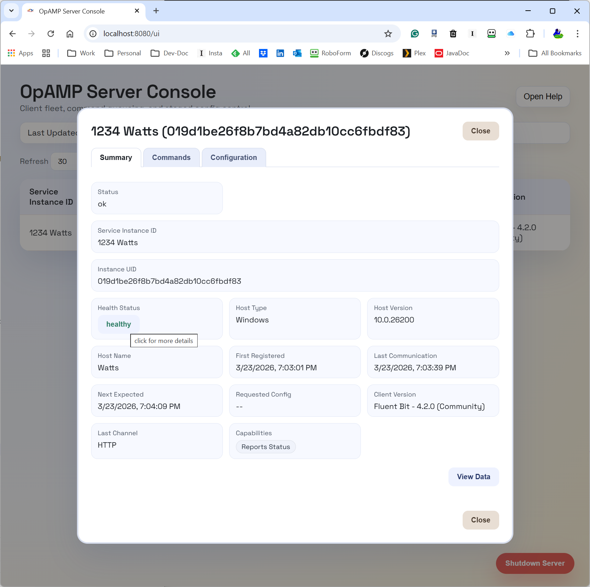
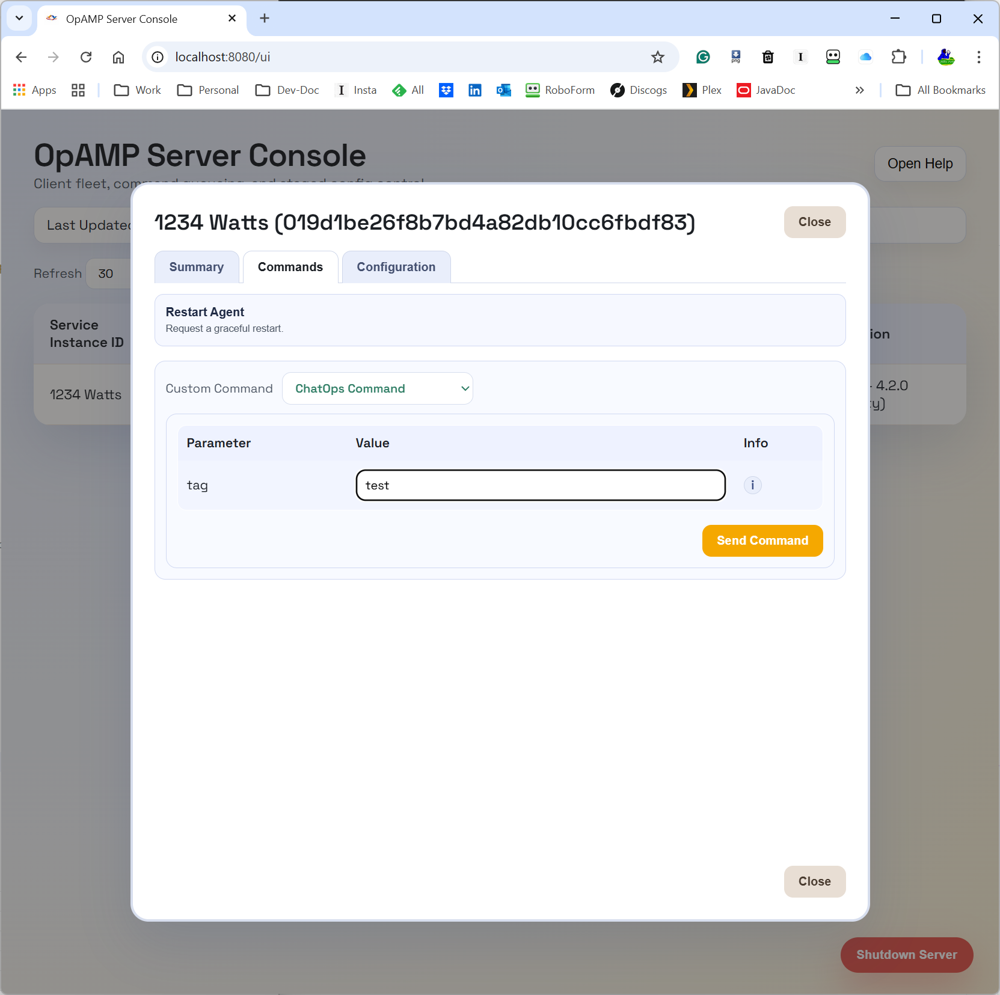

# Screenshots

[TOC]

## The Main Server Console
The main UI which shows a gaininated list of agents (Fluent Bit / Fluentd instances). The columns are sortable.

## Manual Approval of Agent Registration
One of the optional behaviors identified by OpAMP is the ability for a human in the loop approval of accepting agents. This UI is provided if the server is configured to allow the behavior. If an agent is blocked, it will remain blocked.

## Server Functionality Controls
A subset of the server's behavior can be changed and applied in the Global Settings dialog. The controls available are restricted to those that can be dynamically applied, and aren't seen as security risks, such as switching on/off the support for HTTPS.

## Help Details
Help page with headline details, with links to the detailed view. The help is slightly dynamic reflecting key control values.

## Supervisory Summary View
Overview of the Fluent Bit / Fluentd deployment

## Client Command Dialog
The dialog to enable the sending of commands to specific instances.

